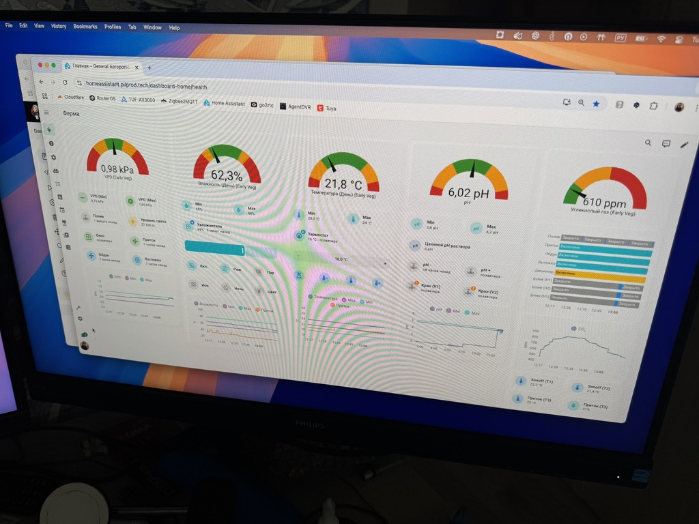
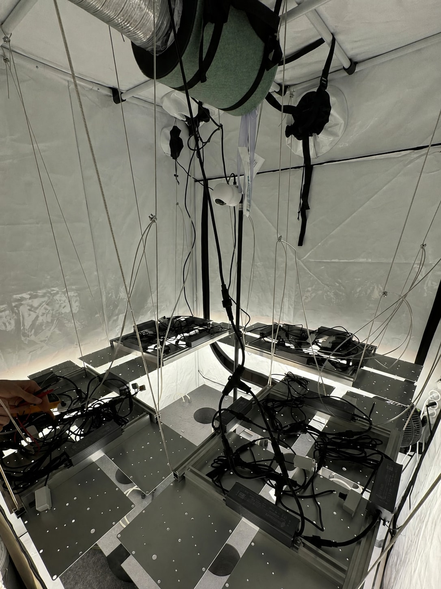
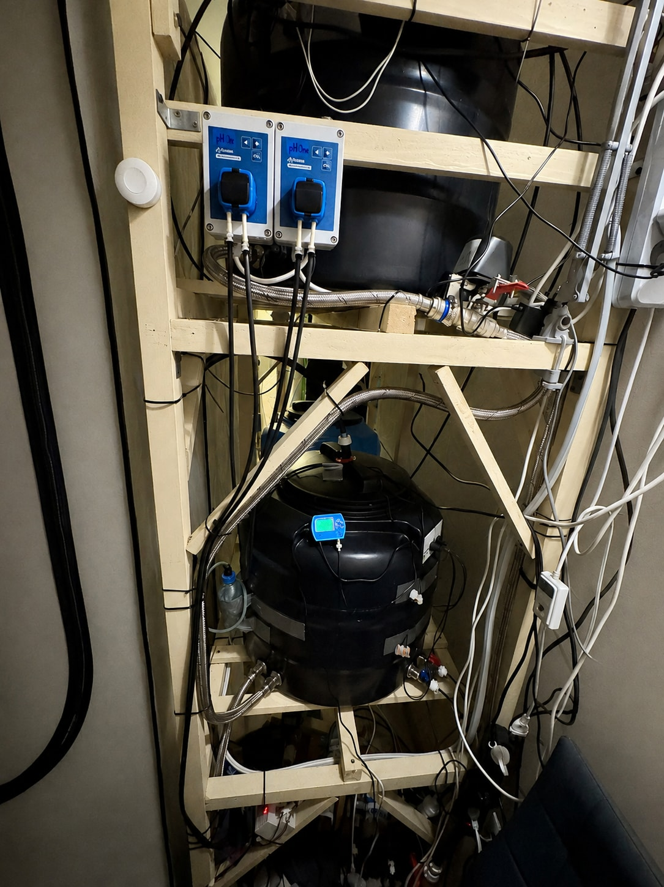
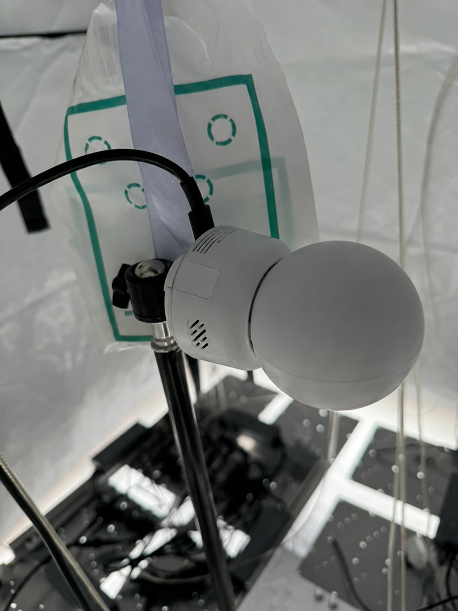
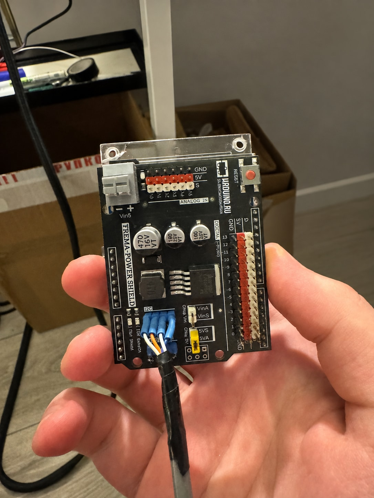
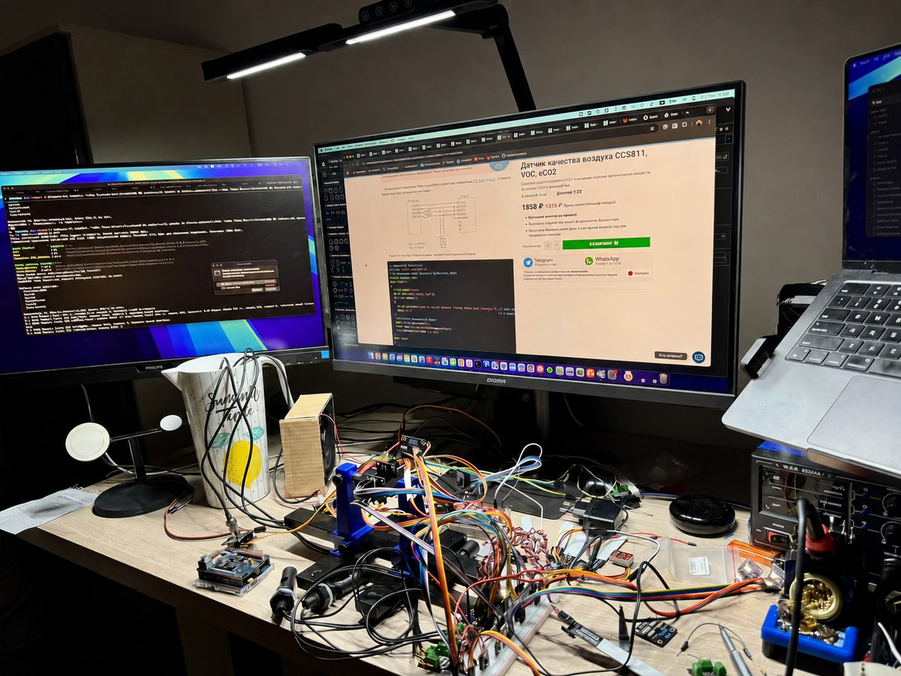
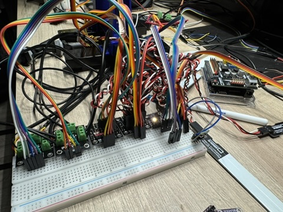
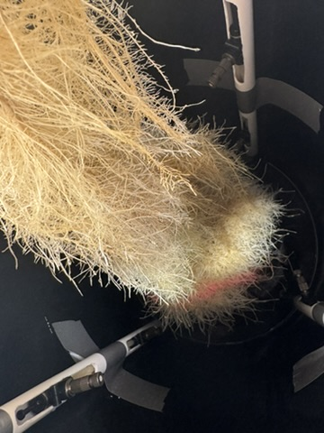
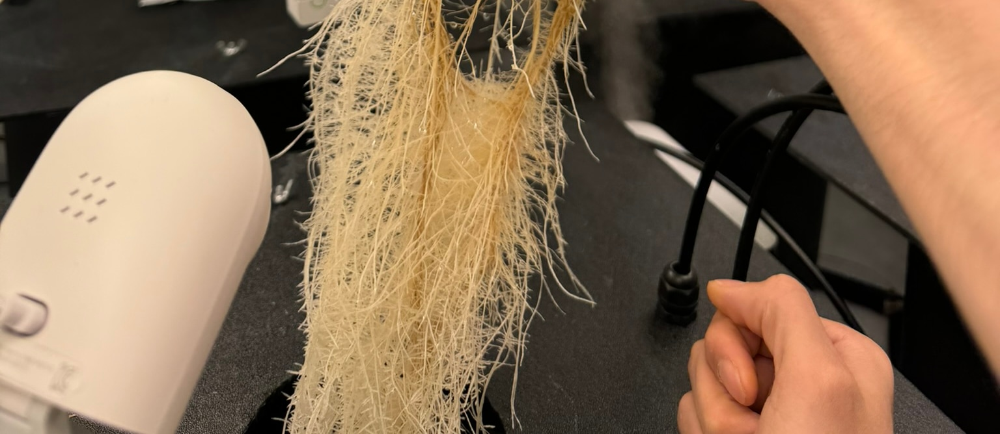

# Aeroponics IoT control — historical R&D snapshot

Python and MQTT integration work from a personal aeroponics lab. This archival portfolio snapshot shows device-control components, not a complete Home Assistant installation.

## Included work

- `hisense.py`: MQTT state tracking and IR commands for power, mode, temperature, fan, swing and display settings.
- `timberk.py`: humidifier state transitions, last-command tracking, and steam, ion, light and night-mode control.
- `timberk_propagator.py`: the original separate propagator-controller variant.
- `examples/`: sanitized Mosquitto and Zigbee2MQTT integration examples derived from the lab manifests.

The controllers use Python, `paho-mqtt`, JSON, command-line arguments, state subscriptions, timeouts and lock files. Home Assistant provided the user-facing control and monitoring layer; live installation data is excluded.

## Lab gallery

Photos from the original personal R&D installation. They show the wider hardware and Home Assistant environment; this repository contains only the controller and integration snapshot described above.

Five installation and workbench photographs have AI-retouched backgrounds or identifying areas for privacy and presentation.

### Monitoring and control

**Home Assistant dashboard** — the interface for climate, lighting and water-system monitoring and control.

### Installation and assembly

<table>
  <tr>
    <td width="50%"></td>
    <td width="50%"></td>
  </tr>
  <tr>
    <td><strong>Lighting &amp; ventilation</strong> Enclosure, suspended fixtures and wiring.</td>
    <td><strong>Water system</strong> Reservoirs, pumps, valves and circulation plumbing.</td>
  </tr>
  <tr>
    <td width="50%"></td>
    <td width="50%"></td>
  </tr>
  <tr>
    <td><strong>Enclosure camera</strong> Camera placement within the installation.</td>
    <td><strong>Power shield</strong> A commercial board integrated into the electronics assembly.</td>
  </tr>
</table>

### Wiring and prototypes

**Electronics workbench** — component wiring and soldering during sensor and controller prototyping.

**Wiring diagram** — component connections documented during system design.

**Breadboard prototype** — early component connections before final assembly.

### Root-zone observations

<table>
  <tr>
    <td width="50%"></td>
    <td width="50%"></td>
  </tr>
  <tr>
    <td><strong>Root-zone overview</strong> A visual record from the experiments.</td>
    <td><strong>Root chamber</strong> The chamber used for root-zone observations.</td>
  </tr>
</table>

**Root inspection** — a closer look at root development, cropped from the original photograph.

## Configuration

Broker, credentials, topics and state/log paths are environment-configured. `.env.example` lists shared settings; export them explicitly because the scripts do not load dotenv files.

Override `MQTT_TOPIC_*` variables to map the generic `portfolio/<controller>/<setting>` namespace to reviewed devices. `MQTT_TOPIC_IR_SEND` requires a compatible IR transmitter. Runtime-path variables use controller prefixes, such as `HISENSE_LOCKFILE`, `TIMBERK_LOG_FILE` and `TIMBERK_LAST_IR_CODE_FILE`.

## Scope and safety

Python syntax has been parsed, but this snapshot has not been executed, integration-tested or safety-tested. Dependency versions were not locked, so current `paho-mqtt` compatibility remains unverified.

Examples are localhost-only lab configurations. Review authentication, transport security, IR-device compatibility and physical safety limits before connecting equipment; do not expose the examples publicly.

## Provenance

See [SOURCE.md](SOURCE.md) for original commits and snapshot changes. Original repositories remain intact. Upstream assets and runtime data are not bundled; no new license grant is added.
